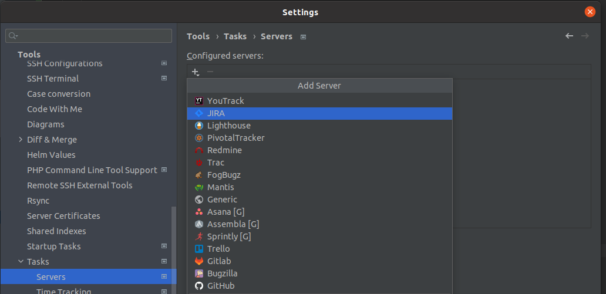

# PHPStorm JIRA Integration Guide

Integrating JIRA with PHPStorm enhances your workflow by providing automatic time tracking, enabling you to pick tasks directly from the editor, and automatically creating change lists and branch names using the issue name. Follow these steps to set up the integration:

## Step 1: Create an API Token
1. Visit [Atlassian API Tokens](https://id.atlassian.com/manage-profile/security/api-tokens).
2. Create a new API token. You can name it `phpstorm`.

## Step 2: Configure PHPStorm
1. Open PHPStorm and navigate to `File → Settings → Tools → Tasks → Servers`.
2. Click the `+` button to add a new server.
3. From the drop-down menu, select `JIRA`.

## Step 3: Server Configuration
1. For the Server URL, enter `https://your-jira-instance-address.atlassian.net/`.
2. Enter your email in the email field.
3. Paste the API token you created in Step 1 into the API token field.
4. Optionally, check `Share URL` if multiple PHPStorm projects will use this issue tracker.
5. Click `Test` to ensure the connection works.
6. Apply the configuration.

## Benefits of Integration
- **Automatic Time Tracking**: Keep track of the time spent on each task without manual input.
- **Task Selection from Editor**: Easily switch between tasks directly from your editor.
- **Automated Branch and Commit Naming**: PHPStorm will automatically create commit messages and branches using the JIRA issue name, reducing manual typing and errors.

## Further Reading
For more detailed information about managing tasks and contexts in PHPStorm, refer to the official [Manage tasks and contexts](https://www.jetbrains.com/help/phpstorm/managing-tasks-and-contexts.html) documentation by JetBrains.

---

By following these steps, you'll seamlessly integrate JIRA with PHPStorm, streamlining your development process and enhancing productivity.

